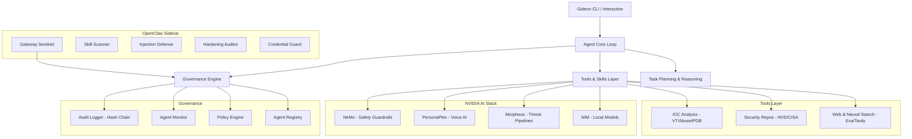

# GIDEON 🛡️

Gideon is an autonomous cybersecurity operations assistant that performs security research using task planning, self-reflection, and real-time threat intelligence data. Built for defensive security operations - detection, mitigation, and protection.


## Overview

Gideon takes complex security questions and turns them into clear, step-by-step research plans. It executes those tasks using live threat intelligence, checks its own work, and refines results until it has a confident, data-backed answer.

**Key Capabilities:**
- **CVE Research**: Search and analyze vulnerabilities from NVD and CISA KEV catalog.
- **IOC Analysis**: Reputation checking for IPs, domains, URLs, and file hashes.
- **Neural Semantic Search**: Deep web research powered by **Exa AI** for technical write-ups and obscure research.
- **Multi-Model Support**: Unified access to 400+ models via **OpenRouter** integration.
- **Daily Briefings**: Automated security intelligence summaries and notable incident tracking.
- **Policy Generation**: Security hardening checklists for AWS, Azure, GCP, K8s, and Okta.
- **OpenClaw Sentinel**: Sidecar security platform for [OpenClaw](https://github.com/openclaw/openclaw) AI agents — real-time gateway monitoring, supply chain defense, prompt injection detection, and credential protection.
- **Agent Governance**: Full lifecycle governance with agent registry, policy engine, behavioral monitoring, access control, and tamper-evident audit logging.
- **Advanced Skills**: Specialized modules for Threat Detection, Data Analytics, Voice AI, and OpenClaw security.
- **Safety & Verification**: Cross-source validation, NeMo Guardrails, and defensive-only safety blocks.

---

## Installation

### Prerequisites

- [Bun](https://bun.com) runtime (v1.3.6 or higher)
- API keys for LLM providers (OpenAI, Anthropic, Google, OpenRouter, or local Ollama)
- Optional: API keys for security data sources (NVD, VirusTotal, AbuseIPDB, Exa AI)

#### Installing Bun

**macOS/Linux:**
```bash
curl -fsSL https://bun.com/install | bash
```

**Windows:**
```bash
powershell -c "irm bun.sh/install.ps1|iex"
```

### Setup

1. Clone the repository:
```bash
git clone https://github.com/cogensec/gideon.git
cd gideon
```

2. Install dependencies:
```bash
bun install
```

3. Set up environment variables:
```bash
cp env.example .env
# Edit .env with your API keys
```

---

## Configuration

Gideon is highly configurable via environment variables and `gideon.config.yaml`.

### LLM & Model Configuration
| Variable | Description |
|----------|-------------|
| `OPENROUTER_API_KEY` | Access to 400+ models from OpenAI, Claude, etc. |
| `OPENAI_API_KEY` | Direct OpenAI API access. |
| `ANTHROPIC_API_KEY` | Direct Anthropic Claude access. |
| `GOOGLE_API_KEY` | Direct Google Gemini access. |
| `OLLAMA_BASE_URL` | Local LLM endpoint (default: `http://127.0.0.1:11434`). |

### Security Data & Search
| Variable | Description |
|----------|-------------|
| `EXA_API_KEY` | Neural semantic search for deep technical research. |
| `TAVILY_API_KEY` | General web search for security intelligence. |
| `NVD_API_KEY` | NIST Vulnerability Database (CVE) access. |
| `VIRUSTOTAL_API_KEY` | Indicator of Compromise (IOC) reputation. |
| `ABUSEIPDB_API_KEY` | IP reputation and malicious actor tracking. |

### NVIDIA AI Integration (Advanced)
Gideon integrates with NVIDIA's AI stack for high-performance operations:
- **NIM**: GPU-accelerated local LLM inference.
- **PersonaPlex**: Hands-free voice AI for security operations.
- **Morpheus**: AI-powered threat detection pipelines (DFP, DGA, Anti-phishing).
- **RAPIDS**: Accelerated data science for batch IOC analysis.
- **NeMo Guardrails**: Enterprise-grade AI safety and topic control.

### OpenClaw Sentinel
| Variable | Description |
|----------|-------------|
| `OPENCLAW_GATEWAY_URL` | OpenClaw WebSocket endpoint (default: `ws://127.0.0.1:18789`). |
| `OPENCLAW_HOME` | OpenClaw installation directory (default: `~/.openclaw`). |

See `gideon.config.yaml` under `openclaw:` for full sidecar configuration.

---

## OpenClaw Sentinel

Gideon ships with a **sidecar security platform** for [OpenClaw](https://github.com/openclaw/openclaw), the 172K-star self-hosted AI agent framework. The sidecar runs independently alongside OpenClaw with zero changes to its codebase, defending against all known CVEs and supply chain threats.

**Defends against:**
| Threat | Description |
|--------|-------------|
| **CVE-2026-25253** | One-click RCE via token exfiltration + WebSocket hijacking (CVSS 8.8) |
| **CVE-2026-24763** | Command injection through unsanitized gateway input |
| **CVE-2026-25157** | Second command injection vector |
| **CVE-2026-22708** | Invisible prompt injection via CSS-hidden web page instructions |
| **ClawHavoc** | 341+ malicious ClawHub skills distributing Atomic macOS Stealer |

**Five security workstreams:**
1. **Gateway Sentinel** — Real-time WebSocket traffic analysis with kill chain tracking and behavioral profiling.
2. **ClawHub Skill Scanner** — Supply chain defense scanning for AMOS payloads, reverse shells, obfuscation, and typosquatting.
3. **Prompt Injection Defense** — 7 pattern detection layers + NeMo Guardrails integration for CSS-hidden instructions, Unicode obfuscation, and role overrides.
4. **Hardening Auditor** — Comprehensive configuration assessment with A-F grading and drift detection.
5. **Credential Guard** — File access monitoring, exfiltration pattern detection, and automatic outbound redaction.

**Quick start:**
```bash
> openclaw-init       # Initialize sidecar and run first audit
> openclaw-status     # Check all module health
> openclaw-audit      # Run hardening assessment
> openclaw-report     # Generate full security report
```

---

## Advanced Skills System

Gideon features a modular "Skills" system that extends its core capabilities.

### 🛡️ Security Research
Advanced bug bounty hunting and penetration testing assistance.
- **Commands**: `start [mode]`, `scope [program]`, `recon [target]`, `hunt [vuln-class]`.
- **Modes**: `bounty`, `pentest`, `research`, `ctf`.

### 🎙️ Voice AI
Hands-free security operations using NVIDIA PersonaPlex.
- **Commands**: `speak [text]`, `voice-set [voice-id]`, `voice-list`, `voice-enable`, `voice-status`.

### 🔍 Threat Detection
Real-time analysis using NVIDIA Morpheus pipelines.
- **Capabilities**: Phishing detection, DGA analysis, Ransomware pattern matching.

### 🛡️ Governance & Safety
Multi-layer protection using NVIDIA NeMo Guardrails.
- **Features**: Jailbreak detection, topic steering, self-correction, and audit logging.

### 🔒 OpenClaw Sentinel
Security sidecar for OpenClaw AI agents.
- **Commands**: `openclaw-init`, `openclaw-audit`, `openclaw-scan-skill <name>`, `openclaw-scan-injection <content>`, `openclaw-scan-memory`, `openclaw-audit-creds`, `openclaw-status`, `openclaw-report`.
- **Coverage**: CVE-2026-25253, CVE-2026-24763, CVE-2026-25157, CVE-2026-22708, ClawHavoc campaign.

---

## Usage

### Interactive Mode
Launch the Gideon shell for natural language queries:
```bash
bun start
```

### Specialized Operations
- **Security Briefing**: `> gideon brief`
- **CVE Lookup**: `> gideon cve CVE-2024-1234`
- **IOC Reputation**: `> gideon ioc 8.8.8.8`
- **Hardening Policy**: `> gideon policy aws`
- **Skill Management**: `> skills` (Show enabled skills and commands)

---

## Architecture

Gideon uses a modular agent-based architecture designed for extensibility:



---

## Safety & Ethics

Gideon is designed **exclusively for defensive security operations**. It includes built-in safety mechanisms to prevent misuse:
1. **Query Filtering**: Rejects requests for exploitation techniques or offensive tools.
2. **Defensive Prompting**: Always prioritizes mitigation, patching, and protection.
3. **Data Redaction**: Automatically redacts sensitive information from logs and outputs.
4. **Safety Guardrails**: Leverages NeMo Guardrails for enterprise-grade topic control.
5. **Agent Governance**: Policy engine, behavioral monitoring, and tamper-evident audit logging for all agent activities.
6. **OpenClaw Protection**: Independent sidecar security for AI agents with real-time threat detection and credential guard.

---

## License
MIT License. Created by **Cogensec** for defenders, by defenders.
Gideon: Your autonomous cybersecurity operations assistant.
