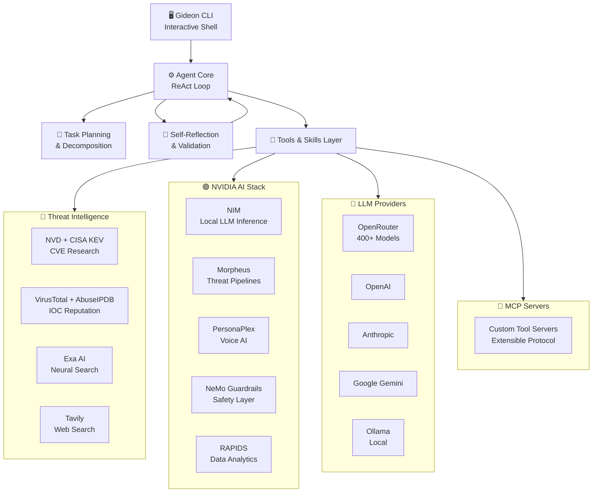

<div align="center">

<pre>
 ██████╗ ██╗██████╗ ███████╗ ██████╗ ███╗   ██╗
██╔════╝ ██║██╔══██╗██╔════╝██╔═══██╗████╗  ██║
██║  ███╗██║██║  ██║█████╗  ██║   ██║██╔██╗ ██║
██║   ██║██║██║  ██║██╔══╝  ██║   ██║██║╚██╗██║
╚██████╔╝██║██████╔╝███████╗╚██████╔╝██║ ╚████║
 ╚═════╝ ╚═╝╚═════╝ ╚══════╝ ╚═════╝ ╚═╝  ╚═══╝
</pre>

### Autonomous Cybersecurity Operations & Red Teaming Agent

*Built by [**Requie**](https://github.com/requie)* *Co-Founder at [**Cogensec**](https://cogensec.com) — Security infrastructure for intelligent machines*

<br/>

[](https://github.com/Cogensec/Gideon/releases)
[](LICENSE)
[](https://bun.com)
[](https://github.com/Cogensec/Gideon)
[](https://www.nvidia.com/en-us/startups/)
[](https://openrouter.ai)
[](https://cogensec.com)
[](https://nvd.nist.gov)
[](https://www.virustotal.com)
[](https://exa.ai)
[](https://modelcontextprotocol.io)
[](https://github.com/Cogensec/Gideon/stargazers)

<br/>


> 🏆 **NVIDIA GTC 2026 Golden Ticket Winner** — Recognized in the NVIDIA Developer Contest for breakthrough work in autonomous AI security operations.

<br/>

**Intelligence Gathering ➜ Threat Analysis ➜ CVE Research ➜ IOC Reputation ➜ Policy Generation ➜ Daily Briefing**

</div>

-----

## What is Gideon?

Gideon is not a script. It is not a scanner. It is an **autonomous security operations agent** that thinks, plans, and acts — transforming complex threat intelligence questions into step-by-step research missions, executing them against live data sources, checking its own reasoning, and delivering confident, evidence-backed answers.

Where traditional security tools require expert configuration and manual correlation, Gideon operates with **goal-directed autonomy**: break down the problem, retrieve the data, validate the results, and synthesize a clear picture of the threat landscape.

Built from the ground up for **defensive operations** — detection, mitigation, and protection. Every response is grounded in real data, every action is auditable, and every output is actionable.

```
> gideon cve CVE-2024-21887

🔍 Researching CVE-2024-21887...
📡 Querying NVD API...
📋 Cross-referencing CISA KEV catalog...
🧠 Analyzing exploit chain and affected systems...
🛡️ Generating mitigation strategy...

✅ CVE-2024-21887 | Ivanti Connect Secure | CVSS 9.1 (Critical)
   Command injection in web components — exploited in the wild.
   CISA KEV: Yes | Patch Available: Yes
   Recommended: Immediate patching + IoC sweep on outbound traffic.
```

-----

## Core Capabilities

|Capability             |Description                                                                     |Data Source           |
|-----------------------|--------------------------------------------------------------------------------|----------------------|
|🔎 **CVE Research**     |Deep vulnerability analysis with CVSS scoring, patch status, and exploit context|NVD + CISA KEV        |
|🌐 **IOC Analysis**     |Reputation checking for IPs, domains, URLs, and file hashes                     |VirusTotal + AbuseIPDB|
|🧠 **Neural Search**    |Semantic deep-web research for obscure advisories and technical write-ups       |Exa AI                |
|🤖 **Multi-Model**      |Unified access to 400+ LLMs from OpenAI, Anthropic, Google, and 50+ providers   |OpenRouter            |
|📰 **Daily Briefings**  |Automated threat intelligence digests with notable incident tracking            |Live feeds            |
|🛡️ **Policy Generation**|Security hardening checklists for AWS, Azure, GCP, Kubernetes, and Okta         |Framework-aligned     |
|🔌 **MCP Protocol**     |Extensible tool integration via Model Context Protocol servers                  |Custom + community    |
|✅ **Self-Verification**|Cross-source validation with defensive-only safety blocks built in              |Internal              |

-----

## NVIDIA AI Stack Integration

Gideon is purpose-built to leverage NVIDIA’s enterprise AI infrastructure — recognized at **NVIDIA GTC 2026** as a leading implementation of the NVIDIA AI stack for security operations.

```
┌─────────────────────────────────────────────────────────┐
│                   NVIDIA AI STACK                        │
├──────────────┬──────────────┬──────────────┬────────────┤
│     NIM      │   Morpheus   │ PersonaPlex  │    NeMo    │
│  GPU-accel   │   Threat     │  Voice AI    │ Guardrails │
│  local LLMs  │  Detection   │  Ops Mode    │  & Safety  │
└──────────────┴──────────────┴──────────────┴────────────┘
                       │
               ┌───────▼───────┐
               │    RAPIDS     │
               │  Accelerated  │
               │  IOC Analysis │
               └───────────────┘
```

|Component          |Role in Gideon                                                                          |
|-------------------|----------------------------------------------------------------------------------------|
|**NIM**            |GPU-accelerated local LLM inference — run models on-prem with sub-second latency        |
|**Morpheus**       |Real-time threat detection pipelines: DFP anomaly detection, DGA analysis, anti-phishing|
|**PersonaPlex**    |Hands-free voice AI for eyes-off security operations                                    |
|**RAPIDS**         |Accelerated data science for batch IOC analysis and large-scale threat correlation      |
|**NeMo Guardrails**|Enterprise-grade AI safety, topic steering, jailbreak detection, and audit logging      |

-----

## Advanced Skills System

Gideon’s modular **Skills** architecture extends core capabilities with specialized intelligence modules. Each skill operates as an autonomous sub-agent with its own toolset, state machine, and command vocabulary.

### 🔴 Security Research

> Advanced-mode bug bounty hunting, penetration testing assistance, and CTF operations.

```bash
> skills security start bounty         # Launch bug bounty research mode
> skills security scope [program]      # Define the target scope
> skills security recon [target]       # Begin passive reconnaissance
> skills security hunt [vuln-class]    # Focus hunt on vulnerability class
```

**Modes**: `bounty` · `pentest` · `research` · `ctf`

-----

### 🎙️ Voice AI *(NVIDIA PersonaPlex)*

> Hands-free security operations — narrate queries, receive spoken threat briefings.

```bash
> skills voice speak [text]            # Text-to-speech output
> skills voice voice-set [voice-id]    # Select voice profile
> skills voice voice-list              # List available voices
> skills voice voice-enable            # Activate voice mode globally
```

-----

### 🔍 Threat Detection *(NVIDIA Morpheus)*

> Real-time behavioral analysis and threat classification using Morpheus AI pipelines.

- **DFP (Digital Fingerprinting)**: Detects anomalous user and entity behavior
- **DGA Detection**: Identifies domain generation algorithm traffic
- **Anti-Phishing**: URL and content analysis for phishing indicators
- **Ransomware Patterns**: Early-stage ransomware behavioral signatures

-----

### 🛡️ Governance & Safety *(NVIDIA NeMo Guardrails)*

> Enterprise-grade AI safety layer — topic steering, self-correction, and full audit trails.

- **Jailbreak Detection**: Intercepts adversarial prompt injection attempts on Gideon itself
- **Topic Steering**: Keeps operations within defined defensive scope
- **Self-Correction**: Detects and corrects off-target reasoning before output
- **Audit Logging**: Cryptographically referenced log of every agent action

-----

### 🔐 OpenClaw Sentinel

> Comprehensive security sidecar for OpenClaw AI agent deployments.

```bash
> skills sentinel openclaw-init                      # Initialize sentinel monitoring
> skills sentinel openclaw-status                    # Runtime security status
> skills sentinel openclaw-audit                     # Full deployment audit
> skills sentinel openclaw-scan-skill [name]         # Scan skill for vulnerabilities
> skills sentinel openclaw-scan-injection [content]  # Prompt injection analysis
> skills sentinel openclaw-report                    # Generate security report
```

|Module                  |Function                                                    |
|------------------------|------------------------------------------------------------|
|Gateway Sentinel        |Monitors and validates all inbound/outbound agent traffic   |
|Skill Scanner           |Detects malicious or compromised skills at load time        |
|Prompt Injection Defense|Real-time injection detection across all input surfaces     |
|Hardening Auditor       |Checks deployment configuration against security baselines  |
|Credential Guard        |Monitors for credential exposure in agent memory and outputs|
|Memory Monitor          |Detects context pollution and memory manipulation attacks   |

**CVE Coverage**: CVE-2026-25253 · CVE-2026-24763 · CVE-2026-25157 · CVE-2026-22708 · ClawHavoc campaign

-----

## Architecture

Gideon implements a **ReAct (Reasoning + Acting)** agent loop — plan, act, observe, reflect, repeat — with a modular tool layer and safety guardrails at every transition.


```mermaid
flowchart TD
    CLI["🖥️ Gideon CLI\nInteractive Shell"] --> Core["⚙️ Agent Core\nReAct Loop"]

    Core --> Plan["🧠 Task Planning\n& Decomposition"]
    Core --> Reflect["🔄 Self-Reflection\n& Validation"]
    Core --> Tools["🔧 Tools & Skills Layer"]

    subgraph INTEL["📡 Threat Intelligence"]
        NVD["NVD + CISA KEV\nCVE Research"]
        VT["VirusTotal + AbuseIPDB\nIOC Reputation"]
        EXA["Exa AI\nNeural Search"]
        TAVILY["Tavily\nWeb Search"]
    end

    subgraph NVIDIA["🟢 NVIDIA AI Stack"]
        NIM["NIM\nLocal LLM Inference"]
        MORPHEUS["Morpheus\nThreat Pipelines"]
        PLEX["PersonaPlex\nVoice AI"]
        NEMO["NeMo Guardrails\nSafety Layer"]
        RAPIDS["RAPIDS\nData Analytics"]
    end

    subgraph MODELS["🤖 LLM Providers"]
        OR["OpenRouter\n400+ Models"]
        OAI["OpenAI"]
        ANT["Anthropic"]
        GGL["Google Gemini"]
        OLL["Ollama\nLocal"]
    end

    subgraph MCP["🔌 MCP Servers"]
        MCPS["Custom Tool Servers\nExtensible Protocol"]
    end

    Tools --> INTEL
    Tools --> NVIDIA
    Tools --> MODELS
    Tools --> MCP
    Reflect --> Core
```

-----

## Installation

### Prerequisites

|Requirement           |Version |Notes                                           |
|----------------------|--------|------------------------------------------------|
|[Bun](https://bun.com)|v1.3.6+ |Primary runtime                                 |
|Node.js               |v18+    |For MCP server compatibility                    |
|LLM Provider          |Any     |OpenAI, Anthropic, Google, OpenRouter, or Ollama|
|Security APIs         |Optional|NVD, VirusTotal, AbuseIPDB, Exa AI              |

### Install Bun

**macOS / Linux**

```bash
curl -fsSL https://bun.com/install | bash
```

**Windows**

```powershell
powershell -c "irm bun.sh/install.ps1|iex"
```

### Quick Start

```bash
# 1. Clone
git clone https://github.com/Cogensec/Gideon.git
cd Gideon

# 2. Install dependencies
bun install

# 3. Configure environment
cp env.example .env
# → Edit .env with your API keys

# 4. Launch
bun start
```

> That’s it. No Docker. No Python environment. No security tools on your host. Just Bun.

-----

## Configuration

All configuration lives in `.env` and `gideon.config.yaml`.

### LLM & Model Providers

|Variable            |Provider  |Notes                                                 |
|--------------------|----------|------------------------------------------------------|
|`OPENROUTER_API_KEY`|OpenRouter|400+ models — recommended for multi-model access      |
|`OPENAI_API_KEY`    |OpenAI    |Direct GPT-4o, o1 access                              |
|`ANTHROPIC_API_KEY` |Anthropic |Direct Claude 3.5/3.7 access                          |
|`GOOGLE_API_KEY`    |Google    |Direct Gemini Pro/Flash access                        |
|`OLLAMA_BASE_URL`   |Ollama    |Local LLM endpoint (default: `http://127.0.0.1:11434`)|

### Threat Intelligence & Search

|Variable            |Service   |Notes                                           |
|--------------------|----------|------------------------------------------------|
|`EXA_API_KEY`       |Exa AI    |Neural semantic search — deep technical research|
|`TAVILY_API_KEY`    |Tavily    |General web search for security intelligence    |
|`NVD_API_KEY`       |NIST NVD  |CVE database — rate limit without key           |
|`VIRUSTOTAL_API_KEY`|VirusTotal|IOC reputation: files, URLs, IPs, domains       |
|`ABUSEIPDB_API_KEY` |AbuseIPDB |IP reputation and malicious actor tracking      |

### NVIDIA AI Stack *(Optional — Advanced)*

|Variable           |Component      |Notes                        |
|-------------------|---------------|-----------------------------|
|`NVIDIA_API_KEY`   |NIM / NVIDIA AI|GPU-accelerated inference    |
|`NIM_BASE_URL`     |NIM            |Local NIM endpoint           |
|`MORPHEUS_ENDPOINT`|Morpheus       |Threat detection pipeline URL|
|`NEMO_CONFIG_PATH` |NeMo Guardrails|Path to guardrails config    |

-----

## Usage

### Interactive Shell

```bash
bun start
```

Launches the Gideon interactive shell. Type natural language security questions or use command shortcuts.

### Command Reference

```bash
# Intelligence Operations
gideon brief                          # Generate daily threat intelligence briefing
gideon cve CVE-2024-21887             # Deep CVE analysis with CVSS + KEV status
gideon ioc 185.220.101.47             # IP reputation check
gideon ioc domain malicious.xyz       # Domain reputation check
gideon ioc hash <sha256>              # File hash reputation check
gideon search "Ivanti zero day 2024"  # Neural semantic search

# Policy & Hardening
gideon policy aws                     # AWS hardening checklist
gideon policy azure                   # Azure hardening checklist
gideon policy gcp                     # GCP hardening checklist
gideon policy k8s                     # Kubernetes hardening checklist
gideon policy okta                    # Okta hardening checklist

# Skills & System
skills                                # Show all enabled skills + commands
skills security start [mode]          # Launch security research skill
skills voice voice-enable             # Enable voice AI mode
skills sentinel openclaw-init         # Initialize OpenClaw Sentinel
```

### Example Sessions

**Threat Research**

```
> What are the latest Ivanti vulnerabilities being exploited in the wild?

🔍 Planning research...
  ├── Query NVD for Ivanti CVEs (last 90 days)
  ├── Cross-reference CISA KEV catalog
  ├── Neural search for exploit write-ups and PoC reports
  └── Synthesize threat actor TTPs

[Results: 4 critical CVEs, 2 in CISA KEV, active exploitation by UNC5337...]
```

**IOC Sweep**

```
> Analyze this C2 IP: 45.142.212.100

🌐 Checking VirusTotal reputation...
🚨 Checking AbuseIPDB history...
📡 Passive DNS resolution...
🔗 Threat actor attribution...

[Result: Known Cobalt Strike C2 — associated with ALPHV ransomware cluster]
```

-----

## Project Structure

```
Gideon/
├── src/
│   ├── agent/          # Core ReAct agent loop + task planner
│   ├── tools/          # CVE, IOC, search, policy tool implementations
│   ├── skills/         # Modular skills system
│   │   ├── security/   # Security research skill
│   │   ├── voice/      # NVIDIA PersonaPlex voice AI
│   │   ├── detection/  # NVIDIA Morpheus threat detection
│   │   ├── governance/ # NeMo guardrails + audit
│   │   └── sentinel/   # OpenClaw Sentinel security sidecar
│   ├── providers/      # LLM provider adapters (OpenAI, Anthropic, OpenRouter...)
│   ├── mcp/            # MCP server integrations
│   └── config/         # Configuration loader + validator
├── mcp-servers/        # Custom MCP server implementations
├── docs/               # Extended documentation
├── gideon.config.yaml  # Main configuration
├── env.example         # Environment template
└── package.json
```

-----

## Roadmap

|Status|Feature                                          |
|------|-------------------------------------------------|
|✅     |CVE research (NVD + CISA KEV)                    |
|✅     |IOC reputation (VirusTotal + AbuseIPDB)          |
|✅     |Neural semantic search (Exa AI)                  |
|✅     |Multi-model support (400+ via OpenRouter)        |
|✅     |Daily briefings                                  |
|✅     |Security hardening policies                      |
|✅     |NVIDIA Morpheus threat detection                 |
|✅     |NVIDIA PersonaPlex voice AI                      |
|✅     |NeMo Guardrails safety layer                     |
|✅     |OpenClaw Sentinel                                |
|✅     |MCP protocol support                             |
|🔄     |ARGUS integration — agent governance layer       |
|🔄     |LITMUS integration — AI model security evaluation|
|🔄     |Web UI dashboard                                 |
|🔜     |NVIDIA RAPIDS batch IOC analytics                |
|🔜     |Shodan + Censys surface discovery                |
|🔜     |Automated MITRE ATT&CK mapping                   |
|🔜     |SIEM integration (Splunk, Elastic, Sentinel)     |

-----

## Safety & Ethics

Gideon is designed **exclusively for defensive security operations** — detection, mitigation, analysis, and protection. The following safety mechanisms are active at all times:

1. **Query Filtering** — Offensive exploitation requests are detected and rejected before execution
1. **Defensive Prompting** — Agent reasoning is anchored to mitigation, patching, and protection outcomes
1. **Data Redaction** — Sensitive values (keys, credentials, PII) are automatically scrubbed from logs and outputs
1. **NeMo Guardrails** — Enterprise-grade topic control, self-correction, and jailbreak interception
1. **Audit Trail** — Every agent action is logged with a traceable, reviewable record

> ⚠️ **Legal Notice**: Gideon is intended for authorized security research, defensive operations, and educational use only. Always ensure you have explicit authorization before analyzing any system, IP, or domain that you do not own. Users are solely responsible for compliance with applicable laws.

-----

## Contributing

Contributions are welcome. See <CONTRIBUTING.md> for guidelines.

- **Security Vulnerabilities**: Do not open public issues. Contact [security@cogensec.com](mailto:security@cogensec.com) directly.
- **Feature Requests**: Open a [Discussion](https://github.com/Cogensec/Gideon/discussions)
- **Bug Reports**: Open an [Issue](https://github.com/Cogensec/Gideon/issues) with reproduction steps and environment details

```bash
# Development setup
git clone https://github.com/Cogensec/Gideon.git
cd Gideon
bun install
bun run dev          # Hot-reload development mode
bun run test         # Run test suite
bun run lint         # TypeScript + ESLint checks
```

-----

<div align="center">

**MIT License** · Built by [Cogensec](https://cogensec.com) — *for defenders, by defenders*

[](http://gideon.cogensec.com)
[](https://linkedin.com/company/cogensec)
[](https://x.com/cogensec)

*Gideon — Your autonomous cybersecurity operations assistant.*

</div>
