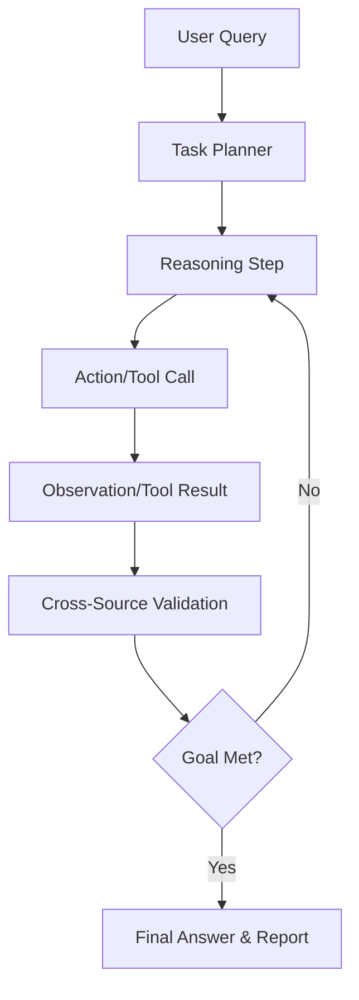

# The Agent Core Loop 🔄

Gideon doesn't just follow a script. It operates using an autonomous reasoning loop based on the **ReAct (Reasoning and Acting)** framework.

## How it Works

The loop follows four distinct stages in every iteration:

### 1. Planning (Reason)
Gideon reviews the current goal and any accumulated context. It decides on the next logical step and explains its reasoning in the scratchpad.

### 2. Execution (Act)
Gideon selects the most appropriate tool for the task (e.g., `cve_search`, `ioc_lookup`) and executes it with structured parameters.

### 3. Verification (Observe)
The result of the tool execution is fed back into the loop. Gideon analyzes the output:
- Is the data sufficient?
- Does it contradict previous findings?
- What is the confidence score?

### 4. Refinement (Reflect)
Gideon asks itself: "What would change my mind?" It tracks assumptions and seeks cross-source corroboration before finalizing an answer.

---

## Visualizing the Loop

## Security Guardrails

The loop is wrapped in a safety layer that monitors every input and output:

1. **Pre-Execution Check**: Rejects any tool calls that appear to target offensive operations.
2. **Confidence Scoring**: If corroboration fails or confidence is low, Gideon explicitly flags the result as an "Assumption."
3. **Topic Steering**: NVIDIA NeMo Guardrails ensure Gideon stays on-topic (Defensive Cybersecurity) and avoids hallucinated instructions.
