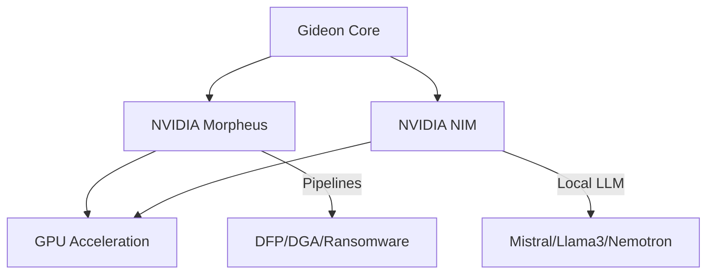

Gideon is built to leverage **NVIDIA AI** technologies for high-performance, real-time cybersecurity operations.

## NVIDIA Morpheus

[NVIDIA Morpheus](https://www.nvidia.com/en-us/deep-learning-ai/solutions/cybersecurity/morpheus/) is an AI framework that provides GPU-accelerated data processing for cybersecurity.

### Performance
By using Morpheus, Gideon can process over **208,333 logs per second**, allowing for enterprise-scale real-time monitoring.

### Enabled Pipelines
Gideon integrates with several Morpheus pipelines:

1.  **Digital Fingerprinting (DFP)**: Detects anomalous user behavior by creating a "fingerprint" of normal activity and flagging deviations.
2.  **DGA Detection**: Uses Deep Learning to identify Domain Generation Algorithms used by malware for Command & Control (C2).
3.  **Phishing Detection**: Employs NLP models to analyze email content for social engineering attempts.
4.  **Ransomware Detection**: Monitors file system behavior for encryption patterns and bulk file modifications.

### Configuration
```bash
MORPHEUS_URL=http://localhost:8080
MORPHEUS_ENABLED=true
```

## NVIDIA NIM

[NVIDIA NIM (Inference Microservices)](https://www.nvidia.com/en-us/ai/#nim) provides optimized, self-hosted AI models.

Gideon can use NIM to host its internal "Self-Reflection" and "Task Planning" LLMs locally on your own GPUs.

### Key Benefits
-   **Privacy**: Security research data never leaves your infrastructure.
-   **Speed**: GPU-optimized inference for complex planning tasks.
-   **Compatibility**: Gideon uses an OpenAI-compatible API to talk to NIM.

### Configuration
```bash
NIM_BASE_URL=http://localhost:8000/v1
NIM_API_KEY=optional
```

## Architecture Diagram


